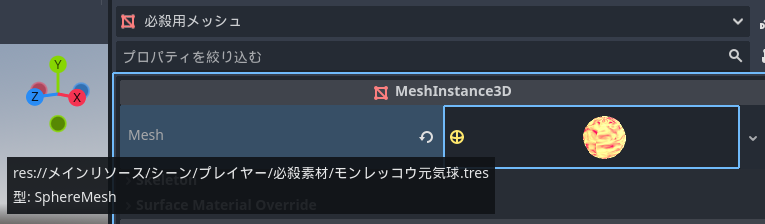

ファイティングキャラクターズ用のMOD制作プロジェクトです
# 作り方
  * ## 注意事項
      * このプロジェクトにある「メインリソース」より下にあるファイルはいじらないでください。
      * リソースをいじっていないつもりでもいじっている可能性があります。 以下のような追加シーンを作ったとします。
    　「必殺用メッシュ」と名付けられたMeshInstance3Dノードのmeshプロパティにリソースが割り当てられています。
       この場合リソースは「メインリソース」の物となっています。
       この中にあるプロパティをいじってしまうと「メインリソース」をいじってしまったことになります。
        
  * sda
      * dsa
      * 
