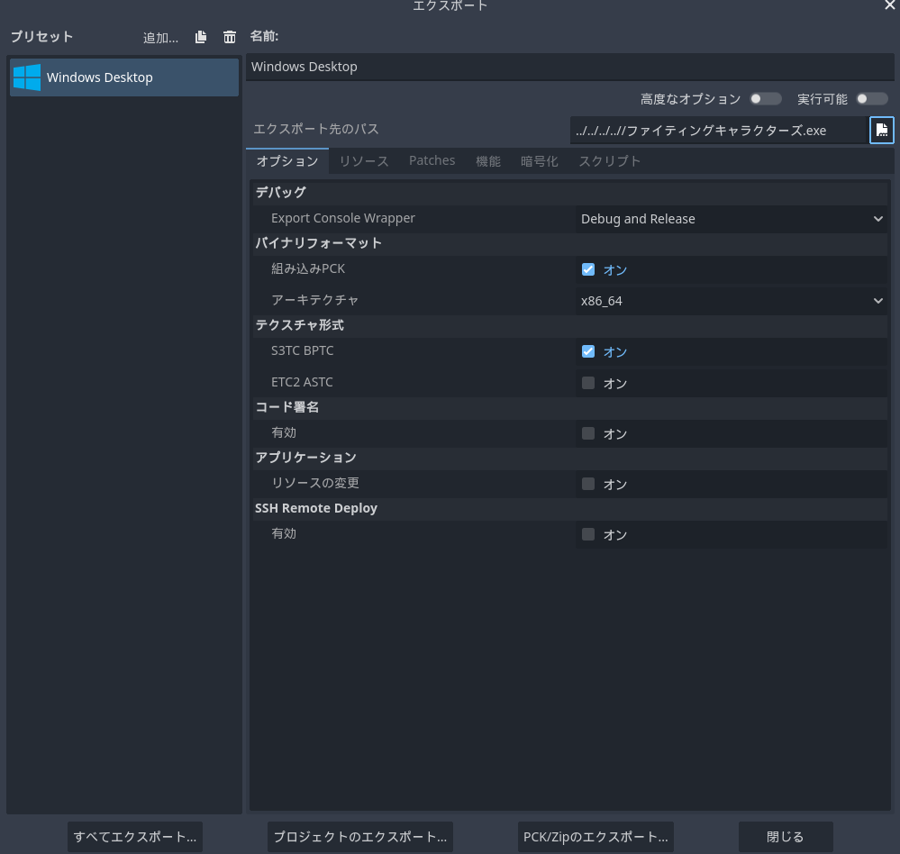
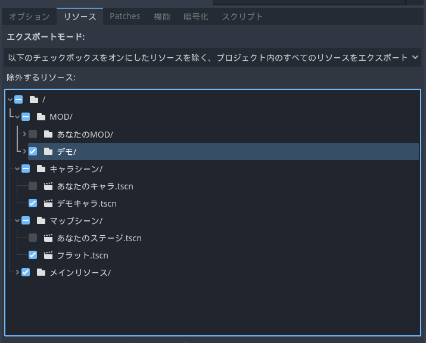
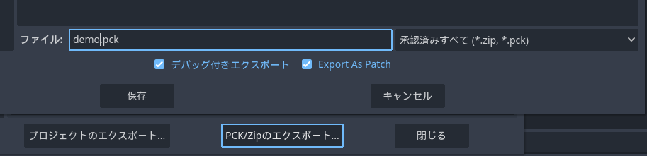

# ファイティングキャラクターズ用のMOD制作プロジェクトです
 ### [開発プロジェクトをダウンロード](https://github.com/legisters-game/FCMOD/releases/tag/MOD%E3%83%97%E3%83%AD%E3%82%B8%E3%82%A7%E3%82%AF%E3%83%88)
# 作り方
  * ## [注意事項](作り方/注意事項.md)
  * ## [キャラ追加方法](作り方/キャラ追加方法.md)
  * ## [ステージ追加方法](作り方/マップ追加方法.md)
  * ## [モード追加方法](作り方/追加モード.md)
# 書き出し方法
  「プロジェクト/エクスポート」からエクスポート画面を表示し、プラットフォームに応じた書き出しプリセットを作ってください。 
   
  「リソース」タブに移り「エクスポートモード」を
  ### 「以下のチェックボックスをオンにしたリソースを除く、プロジェクト内のすべてのリソースをエクスポート」
  を選び「メインリソース」にチェックを入れます。(ダウンロードしたプロジェクトからデモのリソースを消していない方は「MOD/デモ」、「キャラシーン/デモキャラ」、「マップシーン/フラット」にチェックを入れてください。本来は消去しておくべきだと思います。) 
   「PCK/Zipのエクスポート」を選択し、好きな場所に拡張子「.pck」として保存してください。
  「デバッグ付きエクスポート」「Export As Patch」のチェックは関係ないのでどちらでも結構です。
  
  ## ※この時保存した名前がMOD名として読み込まれます。
  ## ※プリセットとは違うプラットフォームで読み込むと上手く動作しないので、対応機種ごとに複数MODをエクスポートしてください。
