# キャラ追加方法
* ## モデルを用意する
  使用するモデルはどのようなものでも構いません。但しそのモデルに適応したアニメーションを全て作成する必要があります。対応拡張子「.glb」
* ## 必要なアニメーション
  

  
表示

    
  アニメーション名前は一致させなくても大丈夫です(正しくは読み込んだ後、リネームします)
  * ## 1必殺
    文字通り必殺技のアニメーションです。2パターンあり、その場で放つ「遠距離技」か相手の元に行き食らわす「直接技」です。 
    遠距離技の場合はそのまま作っていただいてOKです。遠距離技は少し厄介です。 
    相手の場所にワープするときモデルごとワープさせます。そのときの位置が相手の少し手前(その地点から腕を伸ばすと丁度当たるくらいの間隔)です。技がヒットするときのフレームはルートボーン(キャラクターの位置を全て制御できるボーン)を原点(元の位置)に持ってきてください。 
    そして制約があります。相手にワープできるのは相手が必殺技を食らうアニメーションを再生してからです。必殺を食らう側のアニメーションは再生してから1秒間後に倒れるようになっています。つまり相手の元にワープしてからできるアニメーションの時間が1秒未満になります。 
    ワープする前にいろんな動きをさせておいて、いざ飛び掛かる(ルートボーンを原点より前にして前に行かす)。そしてワープする段階でルートボーンを原点よりも後ろに持ってきます。ここのキーは１フレームで素早く後ろに下げます。その後1秒以内に元の位置に戻って(ルートボーンを原点)攻撃を繰り出します。（プレビューで見ると前に行ってその後一瞬で後ろに下がって、そこから原点に戻るようないびつなアニメーションですがそれで完璧です）
  * ## 2必殺
    上記と同様です。
  * ## 3必殺
    上記と同様です。
  * ## 4必殺
    上記と同様です。
  * ## ふらふら
    吹っ飛ばされた後に相手が必殺技を撃つまでの間ふらふらゲージがなくなるまで再生されます。
    1回再生でもよいし、ループさせても可能です。(ループさせる場合綺麗にループするようにしてください)
  * ## アイドル
    これは操作をしていないときのアニメーションです。ループ再生を推奨します(1回再生でもいいですが最後のフレームの位置で止まります。棒立ちとかはそれでも問題ありません)
  * ## キャラ選択モーション
    キャラクターを選択したときに再生されます。
  * ## ダメージ
    攻撃を食らったときに再生されます。一回再生を推奨しますが、痙攣の動作などでループさせることも可能です。
    1フレーム目から食らったアニメーションにしてください。そして元の体勢に戻さないでください。エンジンの方で制御します。
  * ## バリア
    上記と同様です。1フレームからバリアしてください。
  * ## フライ
    空中にいるときに再生されます。ループしてしなくてもどちらでも
  * ## 下蹴り
    空中で蹴るコマンドを入力したときに再生されます。 
    極度にルートボーンを動かすのは避けてください。(当たり判定は動けないので相手からの攻撃が通らず、相手が不利になります)
  * ## 倒れる
    吹っ飛ばしを食らった後に倒れます。それ用のアニメーション。
  * ## 勝利モーション
    戦に勝ったときに再生されます。
  * ## 吹っ飛ばし
    吹っ飛ばしコマンドを入力したときに再生されます。 
    極度にルートボーンを動かすのは避けてください。(当たり判定は動けないので相手からの攻撃が通らず、相手が不利になります)
  * ## 必殺ダメージ
    相手からの必殺を食らったときのモーション。再生から1秒間は待機し、ジャスト1秒後倒れるようにする。
  * ## 必殺バリア
    相手からの必殺技をバリアするときのモーション。再生から1秒以内にバリアのモーションを終わらせます。
  * ## 必殺待機
    必殺技に入る前(選択するとき)のモーション。ループでも1回でもどちらでも。
  * ## 斜め歩き1
    左斜めに移動するときに再生されます。ループさせるので違和感がないように作ってください。
  * ## 斜め歩き2
    右斜めに移動するときに再生されます。ループさせるので違和感がないように作ってください。
  * ## 横歩き
    左側に移動するときに再生します。ループさせるので違和感がないように作ってください。
  * ## 横歩き2
    右側に移動するときに再生します。ループさせるので違和感がないように作ってください。
  * ## 歩き
    前進後進で使用します。ループさせるので違和感がないように作ってください。
  * ## 殴り
    殴るコマンドを入力したときに再生されます。 
    極度にルートボーンを動かすのは避けてください。(当たり判定は動けないので相手からの攻撃が通らず、相手が不利になります)
  * ## 殴り2
    殴るコマンドを２回目に入力したときに再生されます。 
    極度にルートボーンを動かすのは避けてください。(当たり判定は動けないので相手からの攻撃が通らず、相手が不利になります)
  * ## 殴り3
    殴るコマンドを3回目に入力したときに再生されます。 
    極度にルートボーンを動かすのは避けてください。(当たり判定は動けないので相手からの攻撃が通らず、相手が不利になります)
  * ## 登場モーション
    戦闘開始前、に再生されます。
  * ## 負け倒れ
    決着が付き、負けたときに再生されます。
  * ## 蹴り
    地上で蹴るコマンドを入力したときに再生されます。 
    極度にルートボーンを動かすのは避けてください。(当たり判定は動けないので相手からの攻撃が通らず、相手が不利になります)
  ## 計28個あることを確認してください

* ## インポートする
  * ## Blender出力
    

    
表示

      
    GLB形式で書き出すにはここから行います 
    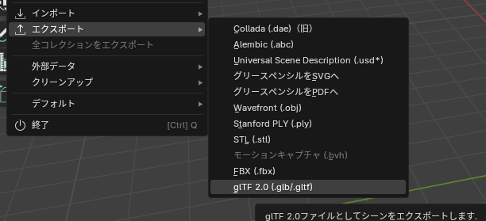 
  アニメーション用とモデル用別々で書き出します。アニメーションはボーンのみを選択し、
  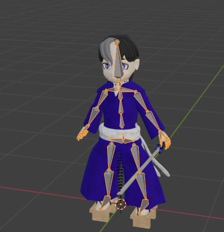 「選択したオブジェクト」にチェックをして書き出します（他は変更なし）
   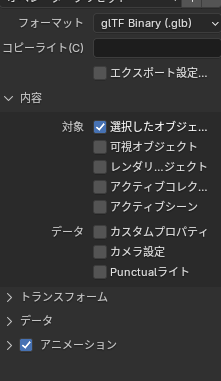 
  モデルエクスポートは必要なオブジェクトすべてを選択し、 
  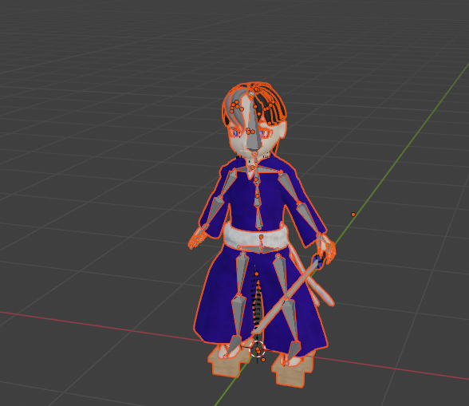 「アニメーション」のチェックを外してエクスポートします。
  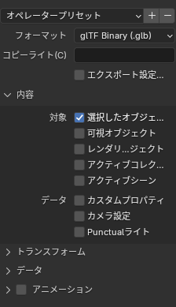 
  これはアセット再インポート時にアニメーションがリセットされてしまうのを防ぐために行います。
　

  * ## Godot読み込み
    

    
表示

    
     「MOD/(MOD名)/キャラデータ/(キャラ名)/キャラglb」といった形で任意のパスにglbファイルを置きます。
    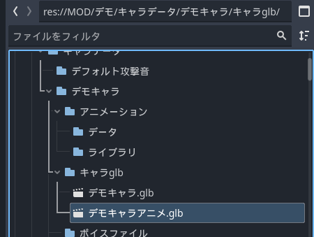 
    アニメーションを保存したGLBファイルを開くとこのような画面になります。 
    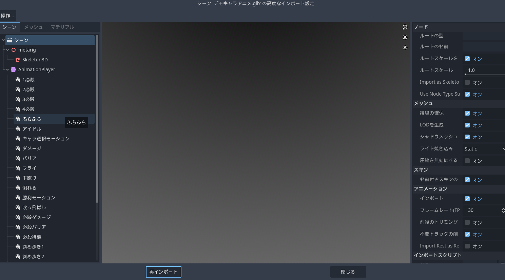 
    [操作/アニメーション保存パスを設定]からアニメーションを保存するフォルダパスを選択します。保存パスは「MOD/(MOD名)/キャラデータ/(キャラ名)/アニメーション/データ」などがよいでしょう。 
   （デフォルトで入っているキャラのアニメーションはメインリソースの物となっています。いじらないでください。） 
    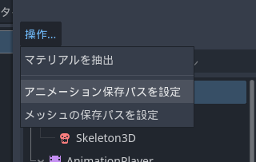後、[再インポート]を押して保存します。
      
    次にキャラのデータ入ったGLBファイルを右クリックして[新しい継承シーン]を選択して新しいシーンを作ります。
    これでGLBのデータを引っ張てきてカスタマイズすることができます。
    このようなシーンかと思います
    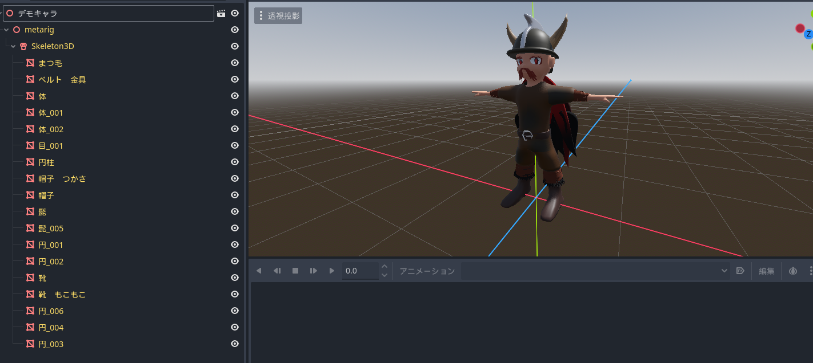このシーンを「MOD/(MOD名)/中間キャラ」といった形でお好みのパスに保存してください。
    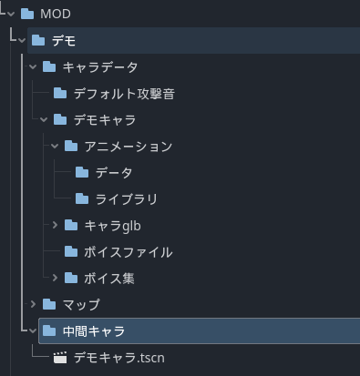
   

   
  * ## 適応させる
    

    
表示

    
    「中間キャラ」フォルダにあるシーンに「AnimationPlayer」ノードを追加します。
    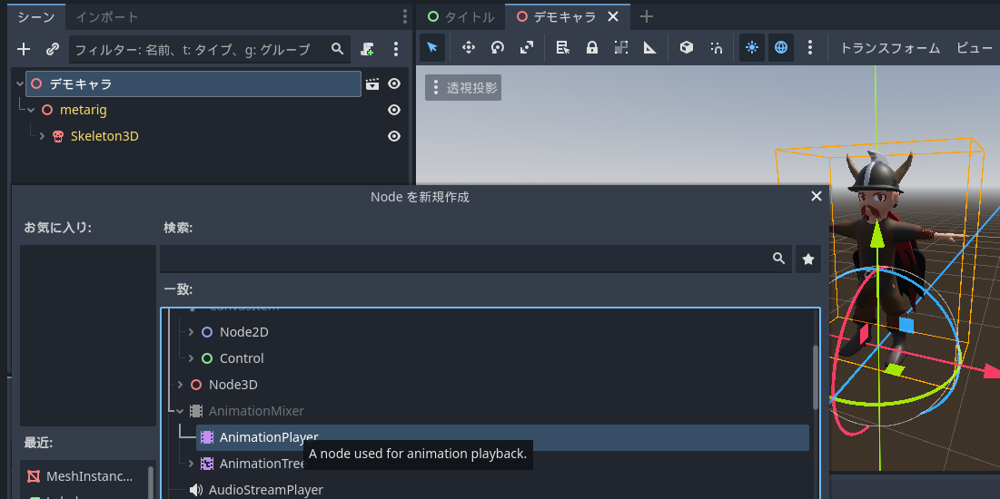
    

    
  
