# キャラ追加方法
※説明の過程でモデルなどが変わっていますが気にしないでください。
* ## モデルを用意する
  使用するモデルはどのようなものでも構いません。但しそのモデルに適応したアニメーションを全て作成する必要があります。対応拡張子「.glb」
* ## 必要なアニメーション
  

  
表示

    
  アニメーション名前は一致させなくても大丈夫です(正しくは読み込んだ後、リネームします)
  * ## 1必殺
    文字通り必殺技のアニメーションです。2パターンあり、その場で放つ「遠距離技」か相手の元に行き食らわす「直接技」です。 
    遠距離技の場合はそのまま作っていただいてOKです。遠距離技は少し厄介です。 
    相手の場所にワープするときモデルごとワープさせます。そのときの位置が相手の少し手前(その地点から腕を伸ばすと丁度当たるくらいの間隔)です。技がヒットするときのフレームはルートボーン(キャラクターの位置を全て制御できるボーン)を原点(元の位置)に持ってきてください。 
    そして制約があります。相手にワープできるのは相手が必殺技を食らうアニメーションを再生してからです。必殺を食らう側のアニメーションは再生してから1秒間後に倒れるようになっています。つまり相手の元にワープしてからできるアニメーションの時間が1秒未満になります。 
    ワープする前にいろんな動きをさせておいて、いざ飛び掛かる(ルートボーンを原点より前にして前に行かす)。そしてワープする段階でルートボーンを原点よりも後ろに持ってきます。ここのキーは１フレームで素早く後ろに下げます。その後1秒以内に元の位置に戻って(ルートボーンを原点)攻撃を繰り出します。（プレビューで見ると前に行ってその後一瞬で後ろに下がって、そこから原点に戻るようないびつなアニメーションですがそれで完璧です）
  * ## 2必殺
    上記と同様です。
  * ## 3必殺
    上記と同様です。
  * ## 4必殺
    上記と同様です。
  * ## ふらふら
    吹っ飛ばされた後に相手が必殺技を撃つまでの間ふらふらゲージがなくなるまで再生されます。
    1回再生でもよいし、ループさせても可能です。(ループさせる場合綺麗にループするようにしてください)
  * ## アイドル
    これは操作をしていないときのアニメーションです。ループ再生を推奨します(1回再生でもいいですが最後のフレームの位置で止まります。棒立ちとかはそれでも問題ありません)
  * ## キャラ選択モーション
    キャラクターを選択したときに再生されます。
  * ## ダメージ
    攻撃を食らったときに再生されます。一回再生を推奨しますが、痙攣の動作などでループさせることも可能です。
    1フレーム目から食らったアニメーションにしてください。そして元の体勢に戻さないでください。エンジンの方で制御します。
  * ## バリア
    上記と同様です。1フレームからバリアしてください。
  * ## フライ
    空中にいるときに再生されます。ループしてしなくてもどちらでも
  * ## 下蹴り
    空中で蹴るコマンドを入力したときに再生されます。 
    極度にルートボーンを動かすのは避けてください。(当たり判定は動けないので相手からの攻撃が通らず、相手が不利になります)
  * ## 倒れる
    吹っ飛ばしを食らった後に倒れます。それ用のアニメーション。
  * ## 勝利モーション
    戦に勝ったときに再生されます。
  * ## 吹っ飛ばし
    吹っ飛ばしコマンドを入力したときに再生されます。 
    極度にルートボーンを動かすのは避けてください。(当たり判定は動けないので相手からの攻撃が通らず、相手が不利になります)
  * ## 必殺ダメージ
    相手からの必殺を食らったときのモーション。再生から1秒間は待機し、ジャスト1秒後倒れるようにする。
  * ## 必殺バリア
    相手からの必殺技をバリアするときのモーション。再生から1秒以内にバリアのモーションを終わらせます。
  * ## 必殺待機
    必殺技に入る前(選択するとき)のモーション。ループでも1回でもどちらでも。
  * ## 斜め歩き1
    左斜めに移動するときに再生されます。ループさせるので違和感がないように作ってください。
  * ## 斜め歩き2
    右斜めに移動するときに再生されます。ループさせるので違和感がないように作ってください。
  * ## 横歩き
    左側に移動するときに再生します。ループさせるので違和感がないように作ってください。
  * ## 横歩き2
    右側に移動するときに再生します。ループさせるので違和感がないように作ってください。
  * ## 歩き
    前進後進で使用します。ループさせるので違和感がないように作ってください。
  * ## 殴り
    殴るコマンドを入力したときに再生されます。 
    極度にルートボーンを動かすのは避けてください。(当たり判定は動けないので相手からの攻撃が通らず、相手が不利になります)
  * ## 殴り2
    殴るコマンドを２回目に入力したときに再生されます。 
    極度にルートボーンを動かすのは避けてください。(当たり判定は動けないので相手からの攻撃が通らず、相手が不利になります)
  * ## 殴り3
    殴るコマンドを3回目に入力したときに再生されます。 
    極度にルートボーンを動かすのは避けてください。(当たり判定は動けないので相手からの攻撃が通らず、相手が不利になります)
  * ## 登場モーション
    戦闘開始前、に再生されます。
  * ## 負け倒れ
    決着が付き、負けたときに再生されます。
  * ## 蹴り
    地上で蹴るコマンドを入力したときに再生されます。 
    極度にルートボーンを動かすのは避けてください。(当たり判定は動けないので相手からの攻撃が通らず、相手が不利になります)
  ## 計28個あることを確認してください

* ## インポートする
  

  
表示

  * ## Blender出力
    

    
表示

      
    GLB形式で書き出すにはここから行います 
     
  アニメーション用とモデル用別々で書き出します。アニメーションはボーンのみを選択し、
   「選択したオブジェクト」にチェックをして書き出します（他は変更なし）
    
  モデルエクスポートは必要なオブジェクトすべてを選択し、 
   「アニメーション」のチェックを外してエクスポートします。
   
  これはアセット再インポート時にアニメーションがリセットされてしまうのを防ぐために行います。
　

  * ## Godot読み込み
    

    
表示

    
     「MOD/(MOD名)/キャラデータ/(キャラ名)/キャラglb」といった形で任意のパスにglbファイルを置きます。
     
    アニメーションを保存したGLBファイルを開くとこのような画面になります。 
     
    [操作/アニメーション保存パスを設定]からアニメーションを保存するフォルダパスを選択します。保存パスは「MOD/(MOD名)/キャラデータ/(キャラ名)/アニメーション/データ」などがよいでしょう。 
   （デフォルトで入っているキャラのアニメーションはメインリソースの物となっています。いじらないでください。） 
    後、[再インポート]を押して保存します。
      
    次にキャラのデータ入ったGLBファイルを右クリックして[新しい継承シーン]を選択して新しいシーンを作ります。
    これでGLBのデータを引っ張てきてカスタマイズすることができます。
    このようなシーンかと思います
    このシーンを「MOD/(MOD名)/中間キャラ」といった形でお好みのパスに保存してください。
    
    

   
  * ## 適応させる
    

    
表示

    
    「中間キャラ」フォルダにあるシーン(以降中間キャラシーンと呼ぶ)に「AnimationPlayer」ノードを追加します。
     
     
    次に「メインリソース/シーン/プレイヤー/インスタンス化素材/モデルノードの子にする」フォルダに入っているシーンを全て(フリーカメラ、声スピーカー、必殺カメラ、必殺用メッシュ、立体音響、衝撃パーティクル)まとめてドラッグアンドドロップします。
    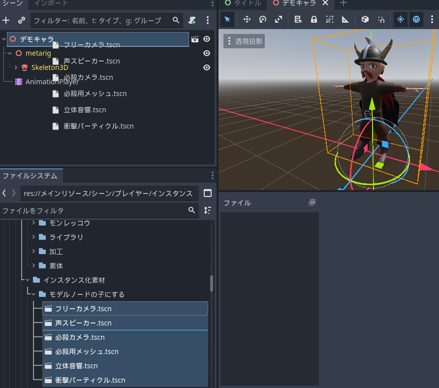 
     
    そして一番上のノード名を「モデル」に変更します。
    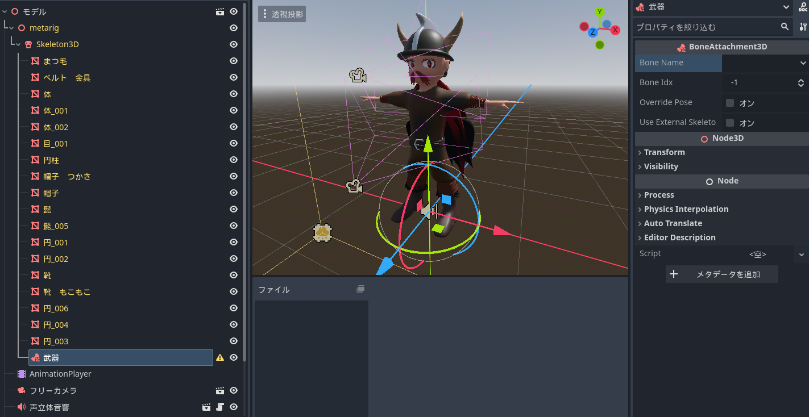 武器を追加したい場合は「BoneAttachment3D」ノードを「武器」と言う名前に変更して「Skeleton3D」の子にし調整します。
    

  * ## アニメーションの準備
    

    
表示

      
    中間キャラシーンにある「AnimationPlayer」ノードをクリックしアニメーションエディタを開きます。
    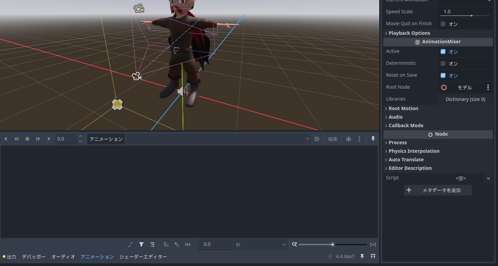 
    「アニメーション」から「アニメーションの管理」をクリックしアニメーションライブラリ編集画面を出します。
    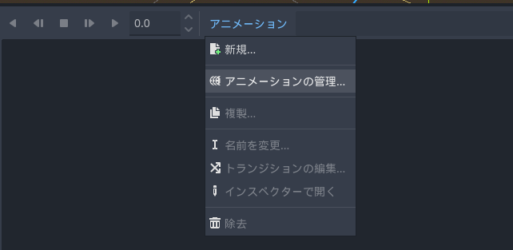 
    「新しいライブラリ」をクリックし「ライブラリ名」を空白にして「OK」をクリックします。
    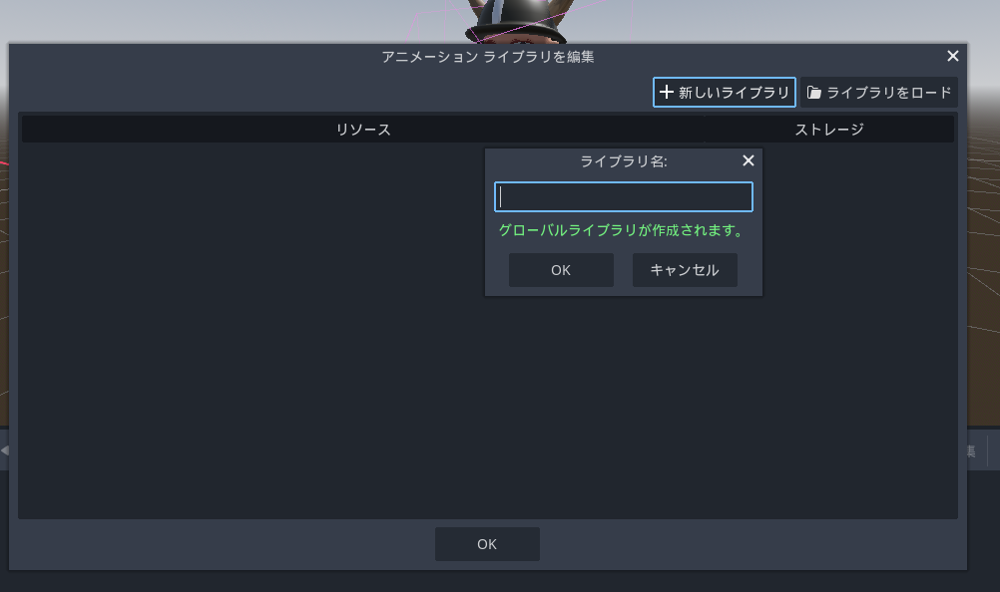 
     
    これでアニメーションを管理する土台(ライブラリ)を作ることができました。 
    フォルダマークをクリックしてファイルからアニメーションを読み込みます。
   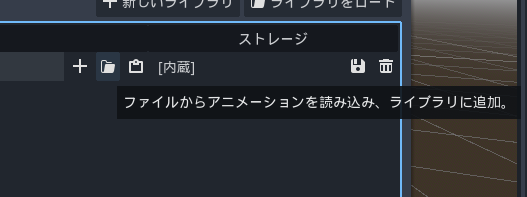 
    マニュアル通り進めていれば「MOD/(MOD名)/キャラデータ/(キャラ名)/アニメーション/データ」に行けばこのようなアニメーションが保存されている場所に出ます。これを一個一個開きます。
  （画像は29個全部ありませんが気にしないでください）
　　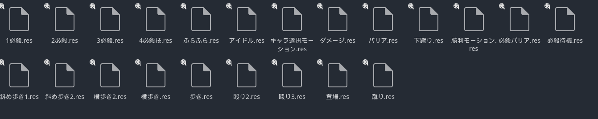 
     右側に表示されているのがリソースの名前(3Dソフトで付けたアニメーション名)で左側で名前を編集することができます。 
    ここの名前を[これ](../作り方/キャラ追加方法.md#必要なアニメーション)と統一してください。
    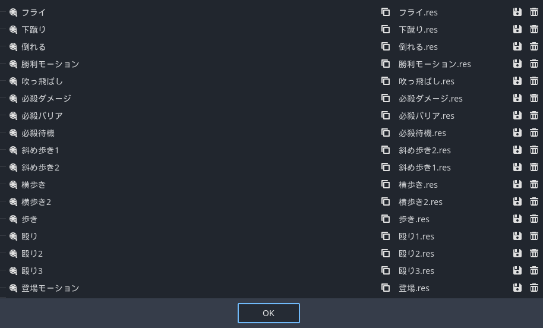  
    最後に今このライブラリはノードの中に保存されているのでフォルダに保存するように変えます(元のリソースからリンクを切って複製するにはユニーク化してから) 
    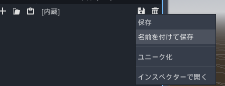 
    ライブラリの保存先は「MOD/(MOD名)/キャラデータ/(キャラ名)/アニメーション/ライブラリ」のようにするのがお勧めです。(画像のライブラリからアニメーションが消えてるは気にしないでください)
    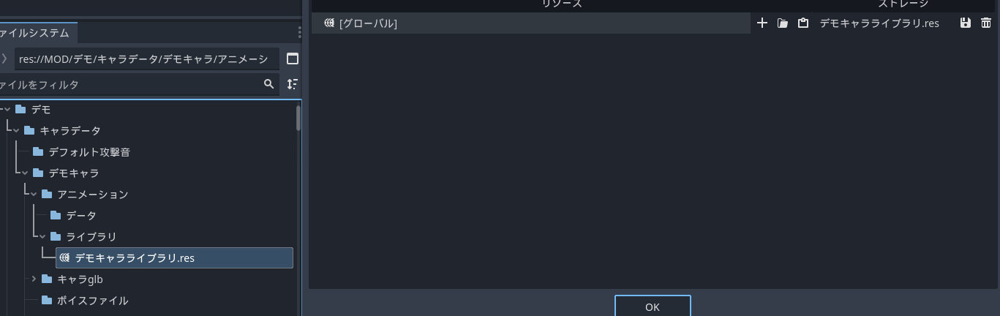 
    

  
  * ## キャラシーンの追加
    

    
表示

    中間キャラシーンを作成できたら次は「メインリソース/シーン/プレイヤー/インスタンス化素材」フォルダに入っている「必須キャラノード」シーンを「新しい継承シーン」で継承し、そのシーンの中にある「プレイヤー」ノードの子として中間キャラシーンを入れます。
    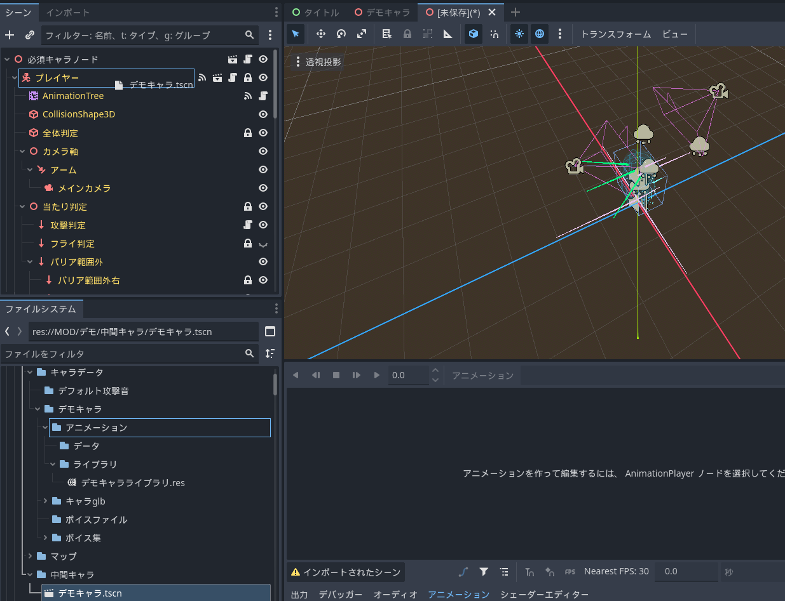 
    このような形になっているので「モデル」を右クリックし「編集可能な子」にチェックをいれます。
    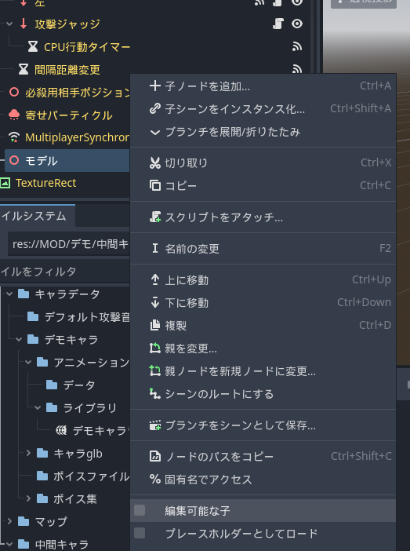  
    上の方に戻って「AnimationTree」ノードの「anim_player」プロパティをクリックし中間キャラシーンの「AnimationPlayer」ノードを選択します。
    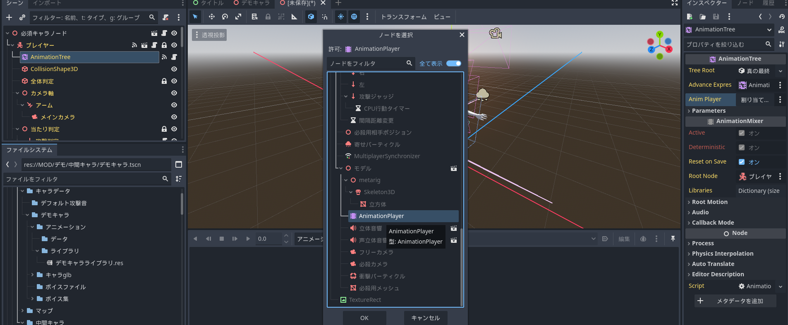  
    「プレイヤー」ノードを選択し「キャラノード」プロパティを「モデル」ノードに割り当てます。
    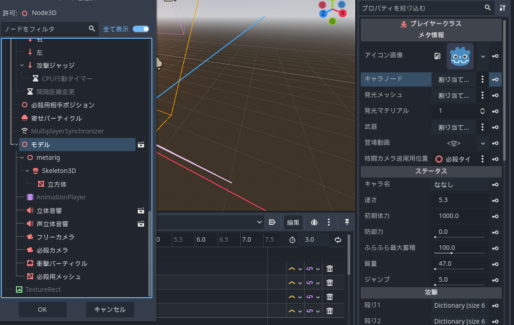  
    以下の画像のようにモデルが180度回転しているので「モデル」ノードを選択し「rotation」プロパティの「Y」を「180」に設定し回転させます。
    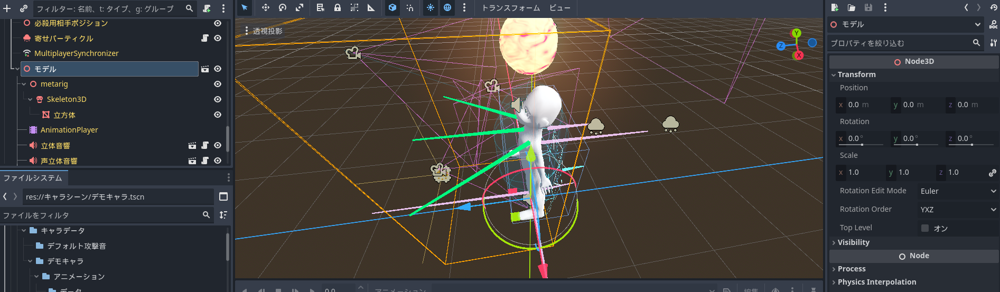 
    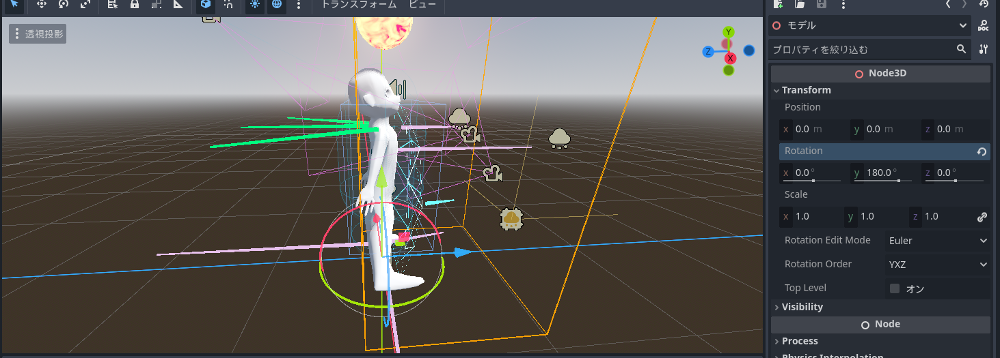 
    ## ※大きさの修正はここではなく中間キャラシーン編集画面に戻って変えます「モデル」ノードの大きさは変えずに「metarig」ノードの大きさを変更してください。
    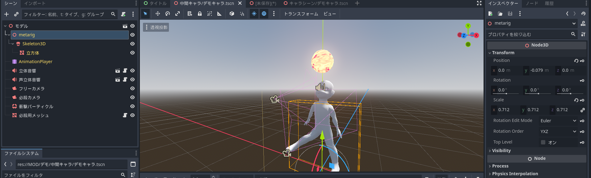  
    「キャラシーン」の「必須キャラノード/プレイヤー/当たり判定/攻撃判定」のノードを選択し「音源ノード」プロパティを「モデル」ノード(中間キャラシーン)の「立体音響」ノードを選択してください。(選択しないとエラーが出ます)
    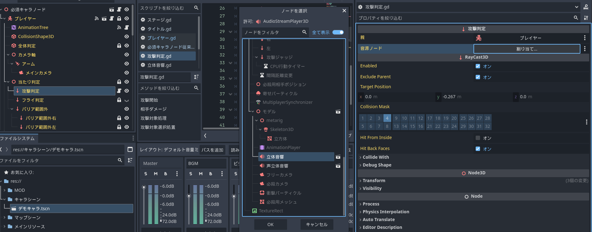  
    「モデル」ノードの「立体音響」と「声立体音響」ノードには「親ノード」というプロパティがあるのでそれぞれ「プレイヤー」ノードを割り当ててください。
    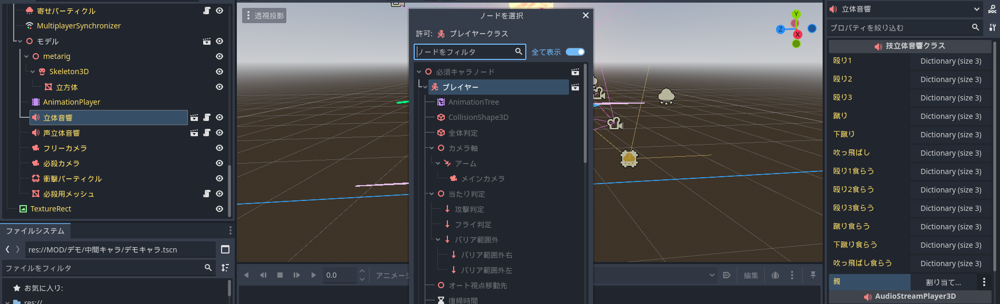  
    最後にこのシーンを「キャラシーン」フォルダに保存してください。(保存名は他の人が作ったキャラクターと被らないようにしてください。MODの名前を含めて雄一無な名前にするのがお勧めです。保存時の名前がキャラの名前にはなりません) 
    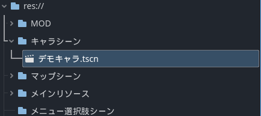 （保存パスは絶対です。他のパスでは読み込まれません）
    

  

* ## カスタマイズ
  * ## ステータス
    

    
表示

      
      プレイヤーシーンの「プレイヤー」ノードをクリックして様々な値を調整できます。 
    この画像で変更して良いプロパティは以下の通りです。 
    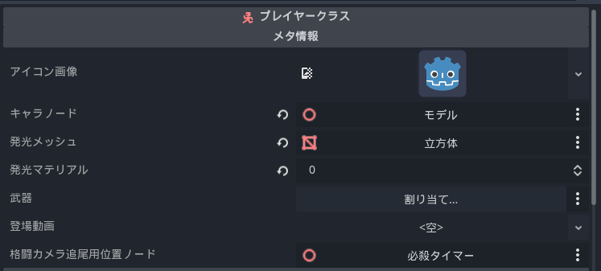 
      * #### アイコン画像:体力ゲージバーのやキャラ選択ボタンに使用される。
      * #### 発光メッシュ:必殺待機時に選択したメッシュが発光します。(発光マテリアルをきちんと設定しないとエラーになる)
      * #### 発光マテリアル:発光メッシュが選択されている場合、そのメッシュのマテリアルの番号(１つのメッシュが複数マテリアル)を指定することで発光する。
      * #### 武器:中間キャラシーンで「武器」ノードを設定した場合ここに割り当てる。
      * #### 登場動画:登場用の動画を割り当てると登場モーション前に再生されます(動画拡張子.ogvのみ)  
    この画像で変更して良いプロパティは以下の通りです。 
    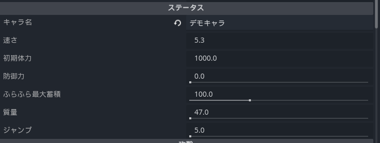 
      * #### キャラ名:体力ゲージやキャラ選択ボタンに表示される名前
      * #### 速さ：5.3がデフォルトです。
      * #### 初期体力:1000がデフォルトです。
      * #### 防御力:割合ではなく食らうダメージ量からこの値を引いた数のみダメージを受けます。(デフォルトは0です)
      * #### ふらふら最大蓄積:1秒間に50消費します。多いほど相手が蓄積できます。
      * #### 質量:滑りやすさに影響します。
      * #### ジャンプ:デフォルトは5です。  
    「殴り1」「殴り2」「殴り3」「蹴り」「下蹴り」「吹っ飛ばし」のそれぞれのプロパティに同じ項目があります。なお以下のプロパティのみいじってOK 
    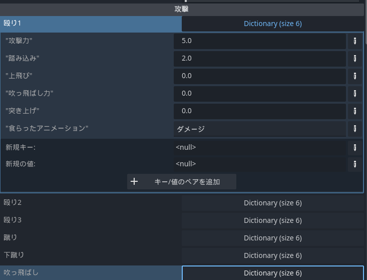 
      * #### 攻撃力:相手に与えるダメージ量
      * #### 踏み込み:技をしたときに前にどれほど進むか
      * #### 上飛び:技をしたときにどれほど上に上がるか
      * #### 吹っ飛ばし力:攻撃を当てたときにどれほど吹き飛ばすか
      * #### 突き上げ:攻撃を当てたとき相手をどれほど上に飛ばすか  
    この画像で変更して良いプロパティは以下の通りです。 
    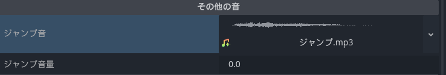 
      * #### ジャンプ音:ジャンプするときに再生される音
      * #### ジャンプ音量:ジャンプ音の音量調整はここでしてください(０を基準にし、大きければ－、小さけらば＋)  
    以下のプロパティは配列になっていて、0が必殺１で3が必殺4となります。 
    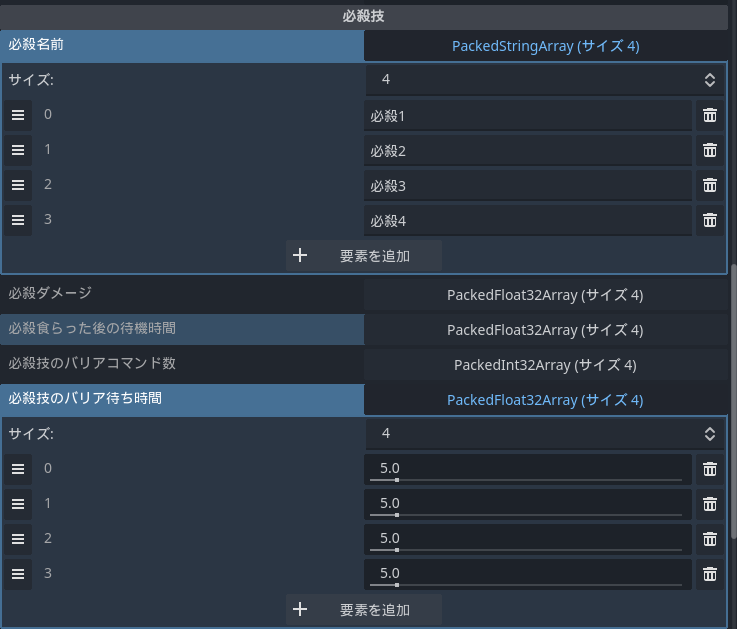 
      * #### 必殺名前:必殺技に名前を付けられます。
      * #### 必殺ダメージ:必殺技が成功したときのダメージ量です。
      * #### 必殺食らった後の待機時間：必殺用の演出が終了し、どれくらい待機するか(秒)
      * #### 必殺技のバリアコマンド数：相手が必殺技をバリアするために必要なコマンドの数
      * #### 必殺技のバリア待ち時間：相手が必殺バリアコマンドを入力できる時間(秒)
    

   
  * ## アニメーション
    

表示

      
     アニメーション設定は「プレイヤーシーン」で行います。「AnimationTree」ノードをクリックして編集します。 
     「トラック追加」から「プロパティトラック」「メソッド呼び出しトラック」の2つを駆使してアニメーションごとに以下のキーフレームを打ってください。(右クリック→キーを挿入)
      * ## 1必殺、2必殺、3必殺、4必殺
        

表示

        
        * 「必殺カメラ」ノード：position,rotation, 
          make_current()　(打つことでカメラが切り替わる) 
          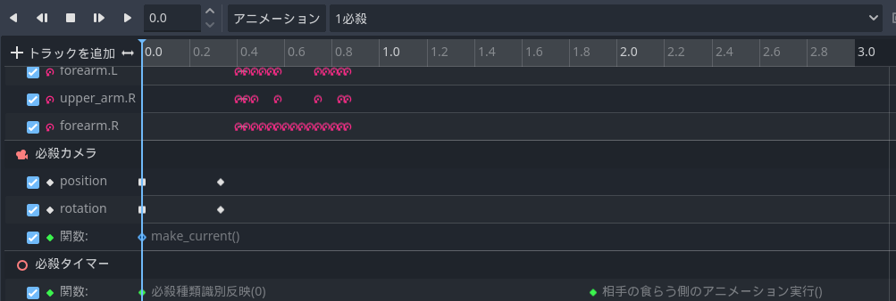 
          カメラに動きをつけることも可能。カメラ切り替えは1度すれば他のカメラが切り替えをしない限りずっと維持し続ける。  
        * 「必殺タイマー」ノード：必殺種類識別反映([必殺番号-1の値])　(「相手の食らう側のアニメーション実行」メソッドよりも前に持ってくる), 
          相手の食らう側のアニメーション実行()　(技が当たる1秒前に打つ。このタイミングで相手側のモーションが始まる。)
          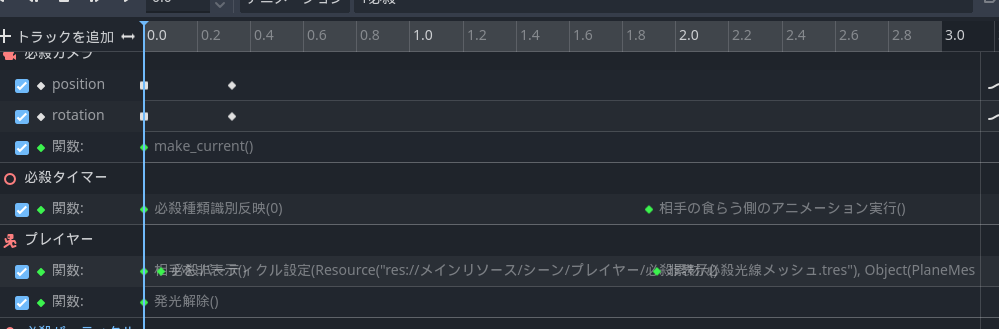 
          相手のモーションが開始した段階でカメラが切り替わるが、開始後の位置で再度カメラを切り替えることでカメラをこっち側に持ってこれる(相手にワープする必殺技だけ使ってください)  
        * 「プレイヤー」ノード:相手を非表示()　（最初に打つ。吹っ飛ばしも距離が取れない可能性の為）, 
          発光解除()　(必殺待機で光らせた部分を消灯したい場合), 
          必殺パーティクル設定([光線のメッシュ。なければ空],[相手にヒットしたときの破片メッシュ],[発射個数。最低1])　(技を撃つよりも前に打つ), 
          非表示()　(相手にワープして自身を映したい場合はいらない。相手側のモーション開始位置に打つ), 
          相手にワープ()　(相手にワープする場合のみ) 
          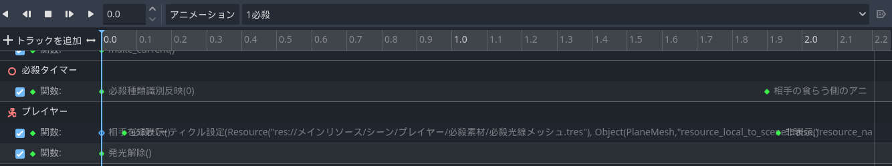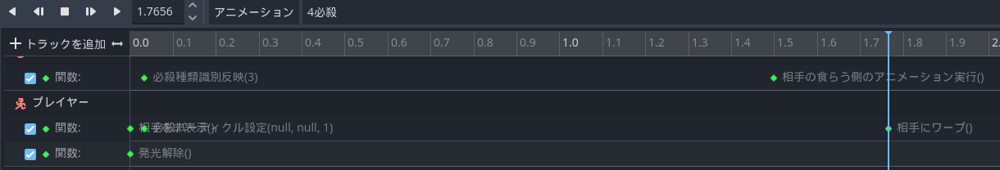 
          必殺パーティクル設定は必ず打ってください。プロパティを上書きするために必要です。  
        * 「必殺パーティクル」ノード：position,rotation, 
          show()　（最初に打つ）, 
          restart()　(パーティクルを出す位置に打つ), 
          hide()　(相手の画面に切り替わる位置に打つ) 
          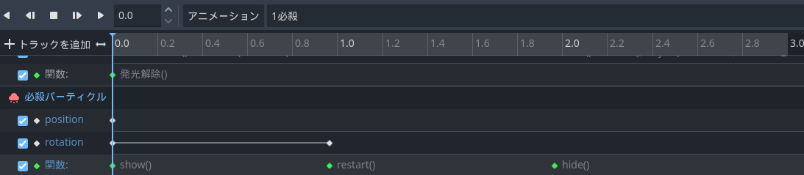 
          光線技を使うときのみ使用します。  
        * 「声立体音響」:「（技名）セリフ再生」メソッドで対応した音声を再生。 
          追加の効果音はプレイヤーシーン側「立体音響」ノードの「再生」メソッドで「ファイル、音量、ピッチ、どこにいても聞こえる」の順で引数を指定する。 
          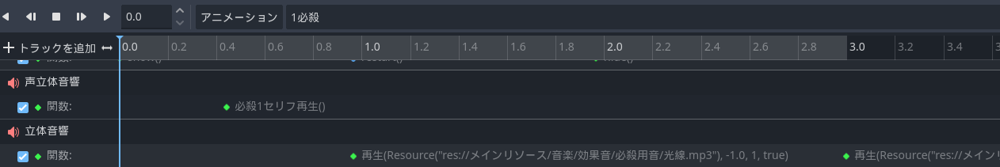 
        * その他「必殺用メッシュ」「寄せパーティクル」「サブ立体音響」「衝撃パーティクル」「フリーカメラ」ノードを活用して表現できます。
        

      * ## ふらふら
        追加の設定はありません。
      * ## アイドル
        追加の設定はありません。
      * ## キャラ選択モーション
         

表示

        
         * 「必殺カメラ」ノード：position,rotation, 
         make_current()　(打つことでカメラが切り替わる) 
          
         カメラに動きをつけることも可能。カメラ切り替えは1度すれば他のカメラが切り替えをしない限りずっと維持し続ける。  
         * 「声立体音響」:「キャラ選択セリフ再生」メソッドで対応した音声を再生。 
          追加の効果音はプレイヤーシーン側「立体音響」ノードの「再生」メソッドで「ファイル、音量、ピッチ、どこにいても聞こえる」の順で引数を指定する。 
           
          このノードは「モデル」ノードの子の「立体音響」ノードで行ってください。
         
 
         
      * ## ダメージ
        

表示

          
        「声立体音響」:「ダメージセリフ再生」メソッドで対応した音声を再生。 
         
        
 
 
      * ## バリア
         追加の設定はありません。
      * ## フライ
        追加の設定はありません。
      * ## 下蹴り、蹴り、殴り、殴り2、殴り3
        

表示

   
        * 「攻撃判定」ノード：position,rotation,scale, 
        攻撃開始()　(攻撃に入る前に打つ), 
        攻撃対象選択処置([攻撃名。殴りは「殴り1」のようにする。],[吹っ飛ばしのみオン])　(このキーを打っている場所のみ攻撃判定が付くので複数連続して打つ) 
        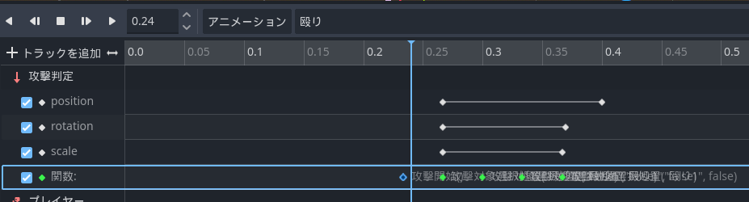 
        大きさ、回転、位置を必ずキー打ってください。範囲攻撃は素早く移動させて全範囲カバーしてください。  
        * 「プレイヤー」ノード：「反動適応メソッド」第一引数に攻撃名(殴り1,殴り2,殴り3,下蹴り,蹴り,吹っ飛ばしのいずれか)を入力する。このキーを打ったタイミングで前進(踏み込み)する。 
        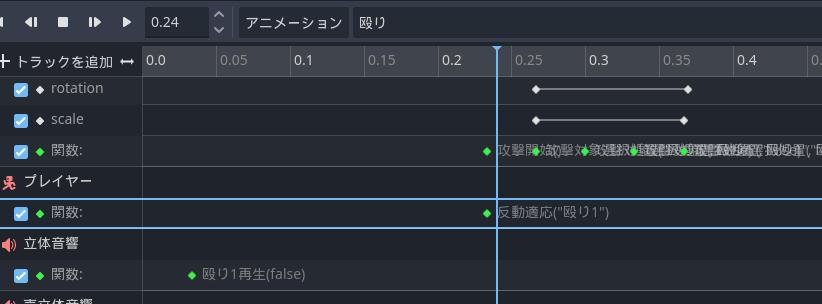 
        反動がない攻撃でも打つように。  
        * 「モデル」ノード側の「立体音響」「声立体音響」ノードを以下のように打つ 
        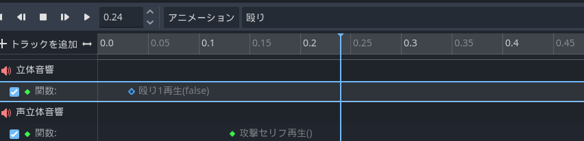 
        「立体音響」の方は攻撃に応じて適切なメソッドに変更すること。 
        
 
      * ## 倒れる
        追加の設定はありません。
      * ## 勝利モーション
        

表示

   
          「必殺カメラ」「声立体音響」を以下のように打つ。 
          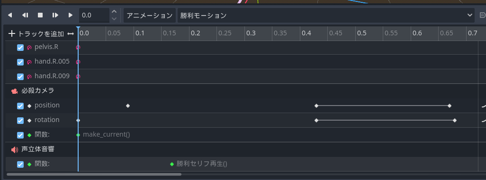 
        

      * ## 必殺ダメージ
        

表示

   
          「必殺カメラ」「相手の必殺パーティクル」を以下のように打つ。 
          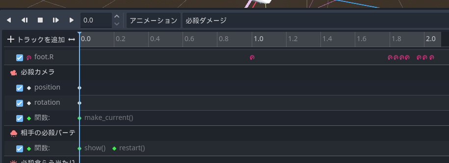 
          「restart()」の位置は丁度パーティクルがアニメーション再生から1秒後にヒットするように調整する。  
          「必殺食らう当たり判定」「声立体音響」を以下のように打つ。 
          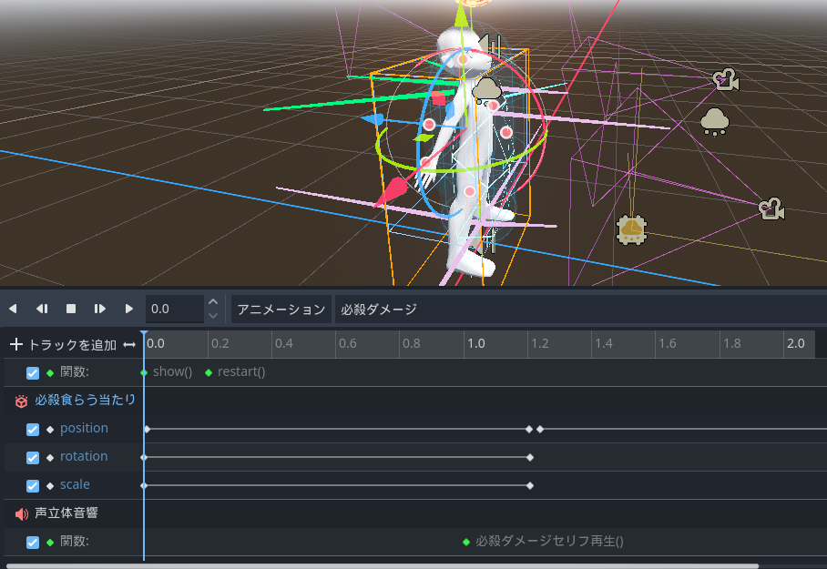 
          「必殺食らう当たり判定」は体(食らう面)に合わせtる。  
          「プレイヤー」の「表示メソッド」は相手の必殺モーションで非表示されたため自身を表示させる。 
          「必殺用相手ポジション」の「position」は相手がワープしてくる位置。自身より少し手前(そこから相手が腕を伸ばして当たるくらいの距離)で高さは0。
          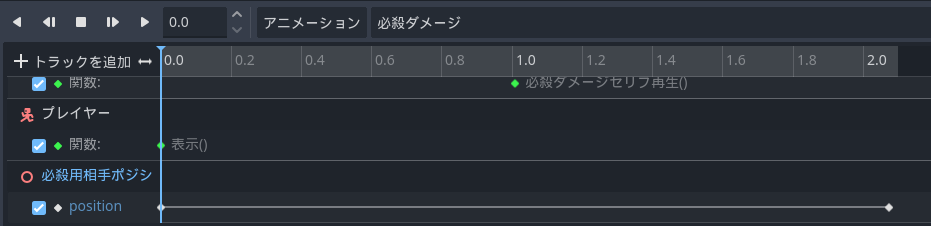 
        

 
      * ## 勝利モーション
        

表示

   
          「[必殺ダメージ]()」とほぼ同じように打つが、 
          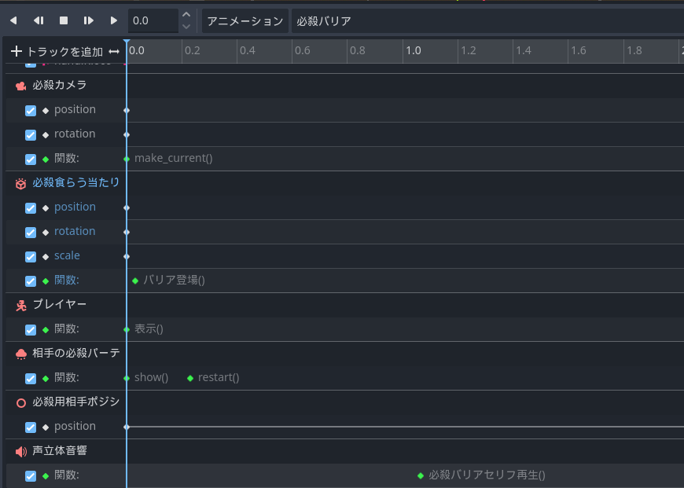 
          「必殺食らう当たり判定」は自身の体より前に出ます。新たに「バリア登場」メソッドを打ちます。 
          その関係上「必殺用相手ポジション」も「[必殺ダメージ]()」よりも手前になります。 
          「必殺パーティクル」の「restart()」のタイミングも遅らせる必要があります。 
        

        

    
 

  * ## ボイス/音
    

表示

      
      中間キャラシーンの編集画面に行き、「立体音響」ノードをクリックし、それぞれのピッチと音声ファイルと音量を設定します。
      「食らう」が付いているのはヒットしたときのみで、付いていないのは技を出すときの音です。
      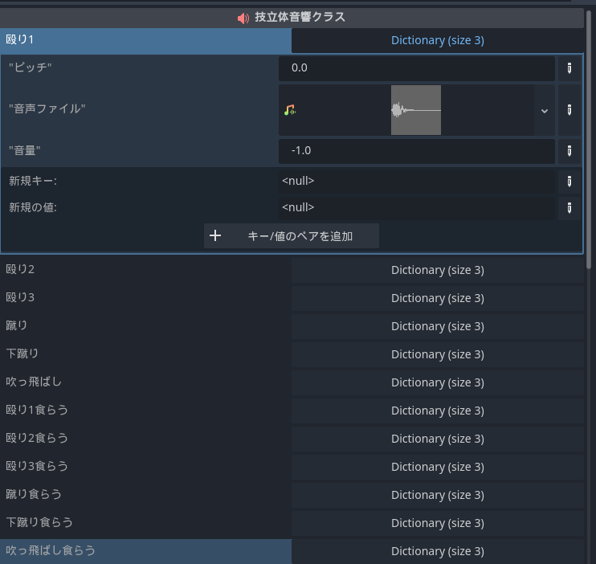  
      「声立体音響」ノードをクリックし、それぞれのプロパティに「AudioStreamRandomizer」を新規追加してその中に音声ファイルを入れます(複数入れることでランダムに再生される)
      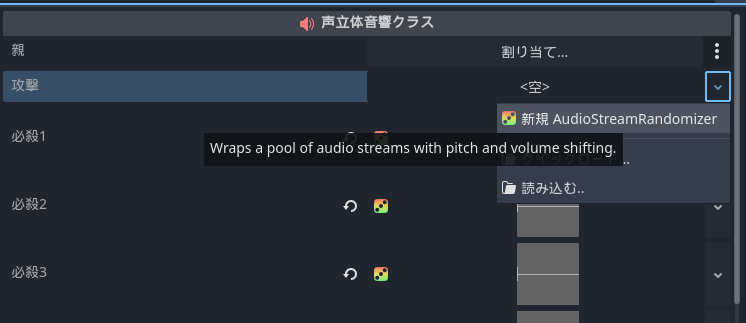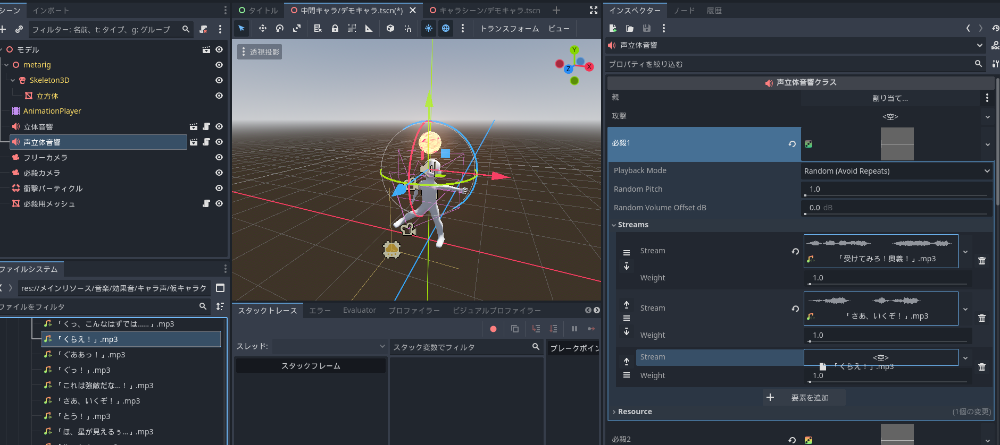 
      なお作成した「AudioStreamRandomizer」は「声立体音響」ノードに保存されているので「名前を付けて保存」してフォルダに保存しておくと良い(後々調整しやすい) 
      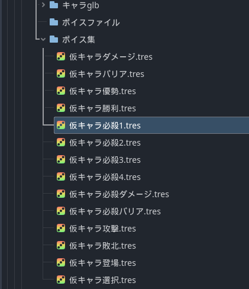  
      「グルーバル音量」はボイスに全て作用します。（これは元の音声ファイルが全て同じ環境で録音されたものとして考え、音量差がないと仮定しているからです）
      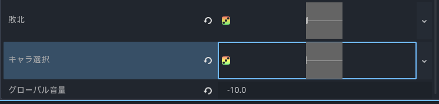 
    

  
