# ステージ追加方法
複数のアプローチがあります。
* ## Godot内で作ったステージ
  作ったステージを一旦「MOD/(MOD名)/中間ステージ」のようなお好みのフォルダに保存します。(以降このシーンを中間ステージシーンと呼びます)
  当たり判定の設定はこの中間ステージシーンで付けてください。
* ## 3Dソフトで作ったステージ
  

  
表示

    
  データをglbファイルで書き出します。 
  「MOD/(MOD名)/ステージデータ/(ステージ名)」のようなフォルダに保存し、ステージごとに管理できるようにフォルダ構成を行ってください。 
  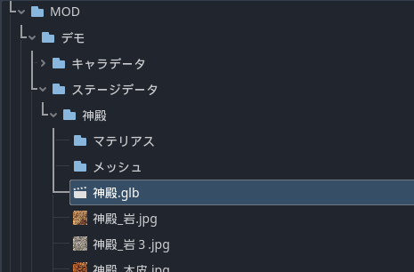 
  続いて「MOD/(MOD名)/ステージデータ/(ステージ名)/メッシュ」、「MOD/(MOD名)/ステージデータ/(ステージ名)/マテリアル」とフォルダを作成し、glbインポート画面(glbファイルダブルクリック)でマテリアルとメッシュのパスを指定して再インポートしてください。 
  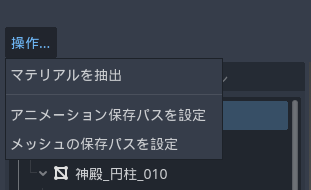 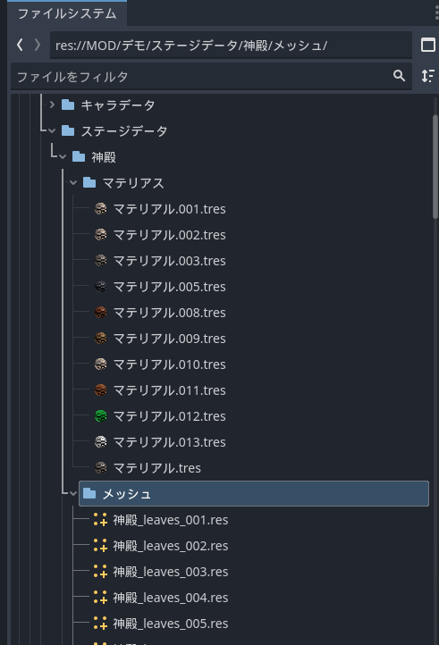  
  これは何を行っているかと言うと、「glb」ファイルにはテクスチャやマテリアルなどのリソースが入っていて１つのシーンとなって保存されています。このシーンを編集するにはGlbのシーンを継承しなけらばなりません。インスタンスによって継承されたシーンのリソースはゲームのディレクトリには保存されず、glbファイルにあるリソースを読み取っている形になります。万が一glbファイルを再インポートした場合、継承したシーンの変更がリセットされてしまうので、リソースを別途保存しました。  
  次にglbファイルを継承してシーンを作成します。
  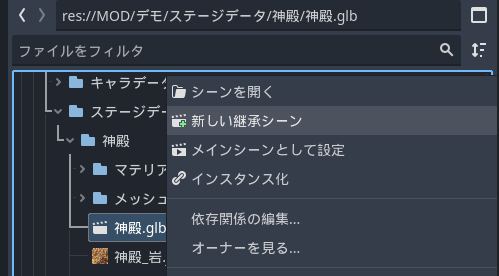  
  この段階ではまだ当たり判定は存在しません。当たり判定を追加したいメッシュを選択し、 
  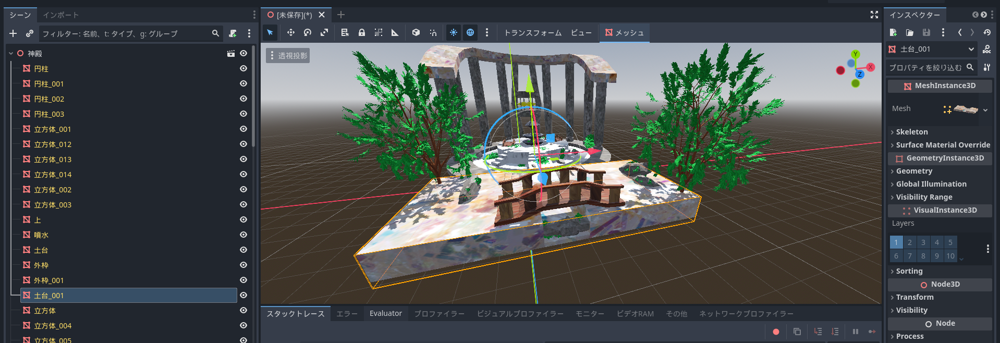 
  「メッシュ/コリジョン形状を作成」から 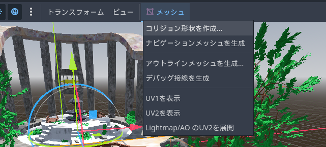  
  「コリジョンシェイプの配置」を「スタティックボディの子」に変更し、「コリジョンシェイプの型」をお好み(マウスカーソルを添えることでそれぞれの詳細が見れます)で選択して、「作成」してください。 
  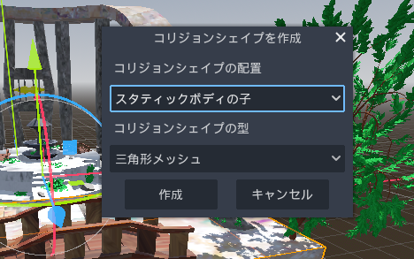  これでメッシュに当たり判定を作成することができました。これを当たり判定が欲しいところに全て行ってください。 
  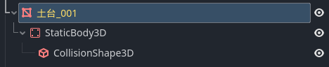  
  エンジンで調整中にやっぱりいらないメッシュがあったりするかと思います。継承されたシーンでは移動は可能ですが、消すという動作は行えません。 
  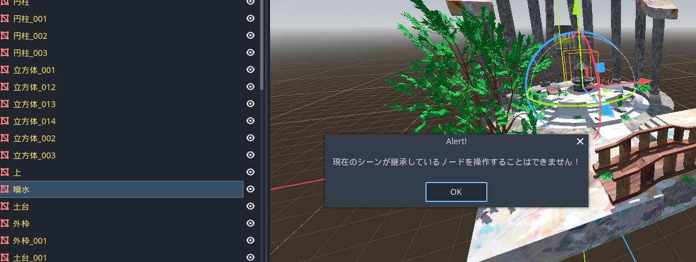  
  このシーンを「MOD/(MOD名)/中間ステージ」のようなお好みのフォルダに保存します。(以降このシーンを中間ステージシーンと呼びます) 
  シーンを保存すると「継承をクリア」という項目が出てきます。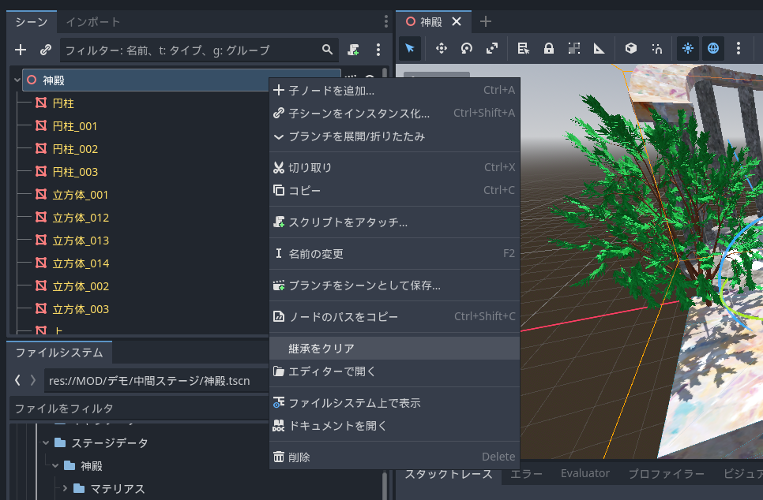 
  そうすることでglbファイルとのリンクを切る(Godotで作ったステージになる)ことができます。「継承をクリア」した後、glbファイルを消去することで容量を削減します。 
  いらないメッシュノードもこれを行うことで消せるようになります。
   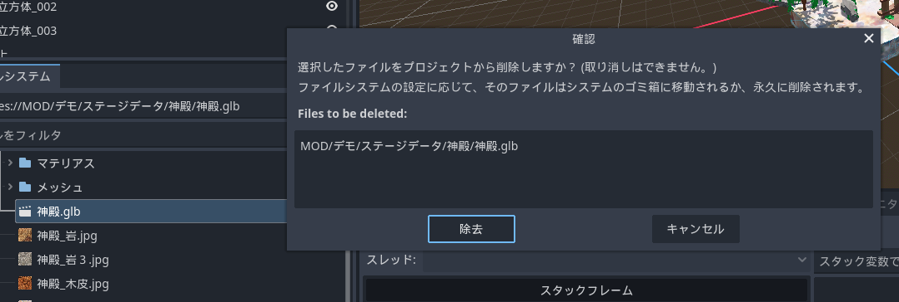  
  

中間ステージシーンが完成したら「メインリソース/シーン/オブジェクト/インスタンス化素」フォルダにある「マップ必須ノード」シーンを継承して新しいシーンを作成します。 
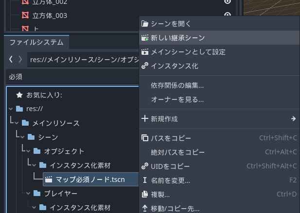 その中に「中間ステージシーン」を持っていきます。
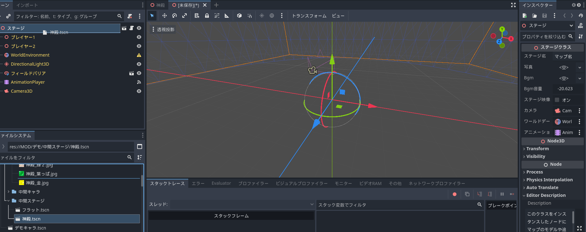 位置、大きさを調整します。「プレイヤー1」「プレイヤー2」ノードはスポーン地点となります。 
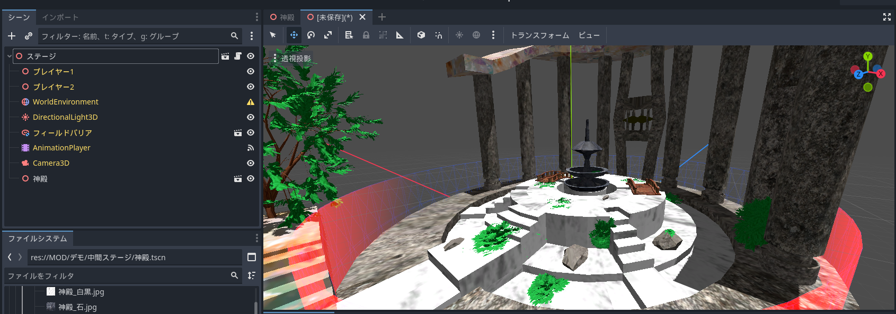 周りが物足りない場合は追加でメッシュをこのシーンに入れます。 この段階で「マップシーン」フォルダにこのシーンを保存してしまいましょう。(エラーでクラッシュすると消えてしまうため)  
背景は「WorldEnvironment」ノードの「environment」プロパティに「新規Environment」で追加することで編集できます。
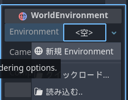詳しい設定は[こちら(まだ翻訳されてません)](https://docs.godotengine.org/ja/4.x/tutorials/3d/environment_and_post_processing.html)を参照してください。  
## このシーンのルートノード名は「ステージ」のままにして変更しないでください。
「ステージ」ノードで以下のプロパティを変更できます。 
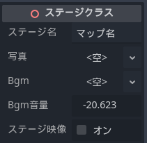「ステージ映像」は「AnimationPlayer」ノードをきちんと設定したときのみオンにしてください。 
（設定できていないと止まってしまいます）  
「AnimationPlayer」ノードではキャラの登場モーション前にステージを映すことができます。 
「アニメーション」から「新規」で新しいアニメーションを作成してください。(名前はなんでもOK)
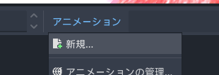 
「Camera3D」ノードのキーフレームを以下のようにお好みに打つ 
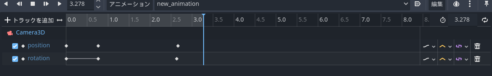 
※カメラは自動で切り替わるようになっています  
## 重要：これにチェックを入れてください
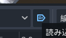　そして「ステージ」ノードの「ステージ映像」プロパティをオンにすることで再生されます。

# 最終チェックです。シーンは「マップシーン」フォルダに保存されていますか？
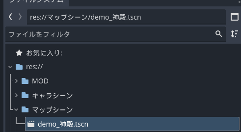
 保存名は唯一無二にして他のMODと競合しないようにしてください。

