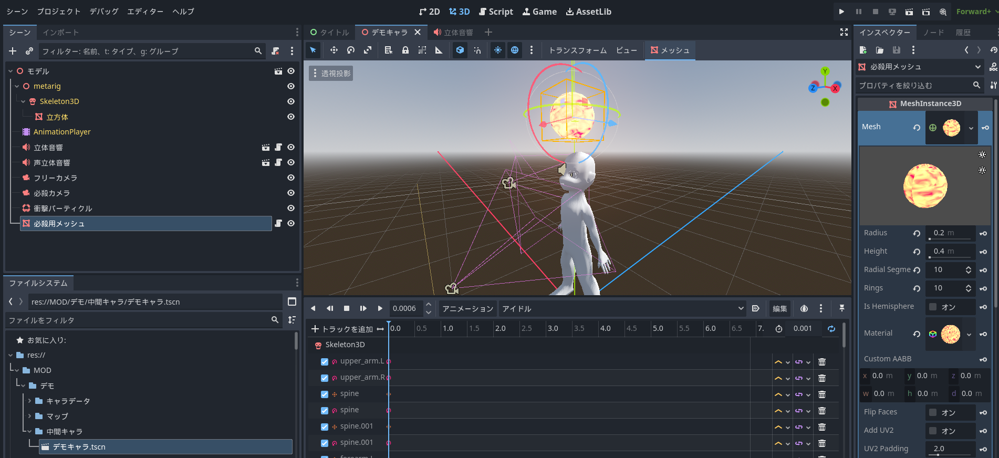
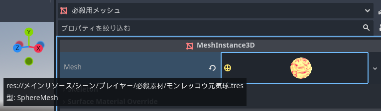

# 注意事項
  * ## このプロジェクトにある「メインリソース」より下にあるファイルはいじらないでください。
  * ## リソースをいじっていないつもりでもいじっている可能性があります。 
   以下のような追加シーンを作ったとします。
  「必殺用メッシュ」と名付けられたMeshInstance3Dノードのmeshプロパティにリソースが割り当てられています。
    この場合リソースは「メインリソース」の物となっています。
    この中にあるプロパティをいじってしまうと「メインリソース」をいじってしまったことになります。
    この画像のように色が付いている範囲がリソースのプロパティです。変更しないでください。リソースを変更する場合は「ユニーク化(リソースを複製して元のリソースと切り離す)」や「新規リソースを作成」してください。
 * ## ファイルを作成する場所は「MOD/(MODの名前)」より下にしてください。（これは他のMODとの競合を避ける為です）
 * ## 「メインリソース」にあるシーンを使う場合、インスタンスをして利用してしてください。
